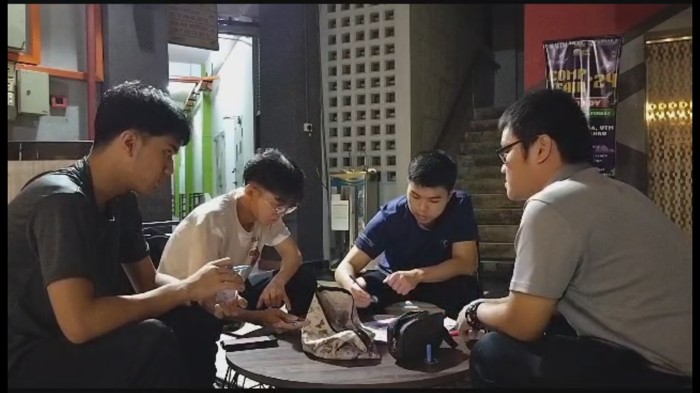
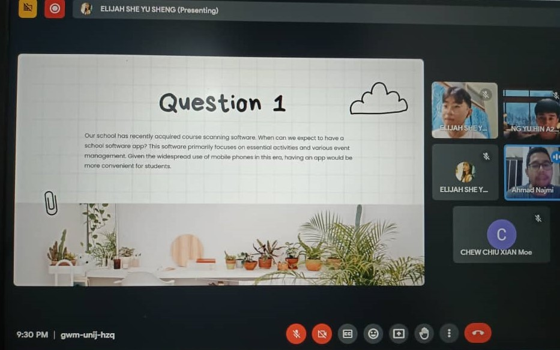

# Technology and Information System 
🖥️🌐 Welcome to the world of Information Systems and Technology! This course is your gateway to understanding how IS/IT shapes our personal and professional lives. Get ready for hands-on experience with PC installation, productivity applications, and dive into the realms of networks, communications, hardware, and software. 💻🔧

🏫 Our labs provide a dynamic learning environment, where you'll gain practical skills and insight into the diverse facets of IS/IT. 💡 Join us for seminars and industry leader visits to bridge the gap between academia and real-world applications. 🤝

🔍 Ready to embark on a quick investigation into the skills and employment requirements for a thriving IT career? 🚀 Let's explore the exciting possibilities that await you in the ever-evolving world of information technology! 🌐🚀
# Timeline

| Date | Activities   |
|--|--|
|23.10.2023 | Industry Talk on Career Development by Mr Habib|
|28.10.2023 | Industry Talk from PPG
|14.11.2023 | Virtual industrial talk on Overview of ICT Jobs in Clarity Techworks |
|17.11.2023 | Industry visit to Petronas and Huawei|
|5.12.2023 | Virtual industry talk by UTM Digital |
|13.12.2023 | Industry visit to UTM Digital|
|28.12.2023 | Virtual industry talk about System Development |

 

# Assignment 1 (Career Development) 
[Poster linkedin](https://www.linkedin.com/posts/esys-sheng-34a008299_throughout-this-talk-we-learn-about-the-activity-7126741162597478400-LE9Q?utm_source=share&utm_medium=member_desktop)
- Reflection:
> Throughout this talk, we learn about the journey of a data engineer, from obtaining a bachelor's degree, entering the industry for internships, and becoming a full-fledged data engineer analyst. In the future, he or she will evolve into a data engineering specialist.

---

# Assignment 2 (Presentation Ch 7 & 8)

 

- Reflection:
> The ubiquity of technology prompts consideration of its ramifications, particularly concerning personal privacy. The question arises as to whether technology facilitates unauthorized access to our private information. Instances such as applying for a loan, obtaining a driver's license, or conducting transactions at supermarkets raise concerns about the potential dissemination and utilization of our information without explicit consent. Similarly, the pervasive use of the internet prompts reflection on the collection and sharing of personal data. A critical inquiry emerges regarding the ways in which criminals might exploit this information for illicit purposes, such as **ransom, blackmail, or acts of vandalism.**
[presentation slide](https://drive.google.com/file/d/1xTrJZGQe1PjWYymB2eztPliefIQKypp_/view?usp=drive_link)
-> https://drive.google.com/file/d/1xTrJZGQe1PjWYymB2eztPliefIQKypp_/view?usp=drive_link

---

# Assignment 3 (Design Thinking)

- Photo:
    <table>
  <tr>
    <th>discussion 1</th>
    <th>discussion 2</th>
  </tr>
  <tr>
    <td></td>
    <td></td>
  </tr>
</table>
- Reflection:
>In design thinking, inventors create or modify applications, employing critical thinking to meet users' needs. The core principles are empathy, ideate, prototyping, and iteration adapt to solve complex problems, >ensuring effective, user-friendly solutions. There are many types of computer software, such as educational software, utility software, application software, enterprise software, programming software and system >software. However, our report mainly delves into educational software, emphasizing the importance of tailored solutions within this broader domain.

- [Video for Design Thinking](https://www.youtube.com/watch?v=AEObz1Dx_Mo)
- [Report of Design Thinking](https://github.com/cxchew/TIS/blob/main/image/tis%20assignment%20rework%20(1)%20(1).docx)

---

# Assignment 4 (Newsletter)

  - Photo:
    <table>
 <tr>
    <th>Petronas</th>
    <th>Huawei</th>
  </tr>
  <tr>
    <td></td>
    <td></td>
  </tr>
</table>

- Reflection:
  > On Friday, 17 November 2023, first-year data engineering students had went to Petronas office (Menara ExxonMobil) and Huawei Customer Solution Innovation Centre (CSIC) in Kuala Lumpur for an industry visits. Through the visits in Petronas, we had widened our understanding about the productive mind of a software engineer and his crucial role in a company. Besides that, mentioned by the Head of software engineering and testing at PETRONAS Digital, Sir Roman Kvaska, we also learned that some skills like analytical skills and life-long learning is necessary to be mastered flawlessly to secure job in this competitive environment which technology kept advancing. While in Huawei, we were able to witness a cutting-edged technologies that beyond our curriculum. This had deepend our understanding about ICT and it's impacts to our daily life. Even though the visit was short and rushed, but we still able to learn many things fro the visits. Overall, the whole visits was great and memorable. I hope we can visits more industries similar to these visits in the future.
  - [Newsletter](https://github.com/Elijah0413/tis-technology-and-info-system/blob/main/assignment/assignment4/ASSIGNMENT%203%20INDUSTRY%20VISIT%20HUAWEIPETRONAS%20GROUP%202%20(1).pdf)
 

---

# Assignment 5 ( UTMDigital visit)
- [Video](https://www.youtube.com/watch?v=46His0jLaX4)
- Photos: 
  </tr>
  <tr>
    <td></td>
    <td></td>
  </tr>
</table>
- Reflection:
> On the 13th of December 2023, our class, TIS SECP1013 Section 02, had the privilege of visiting UTMDigital, courtesy of Dr Aryati. The office spaces at UTMDigital were designed in the style of Google Spaces, offering a flexible and collaborative environment capable of accommodating up to 60 staff members simultaneously. Plans were underway to expand the office further, adding more tables to facilitate an additional 20 to 25 staff. The open office layout featured workspaces, meeting rooms, discussion areas, and relaxation spaces, all contributing to a conducive and productive atmosphere for the staff.

> Our tour continued to the UTM Digital Care offices, where we gained insights into their pivotal role in addressing ICT issues through email correspondence. The problem-solving process involved multiple levels; initial resolutions occurred at the ground level through emails or simple calls. Persistent issues escalated to level 1, involving the technical team, and the final level, level 2, included direct engagement with providers like Telekom Malaysia.

> The concluding part of our visit took us to the highly secure Data Center. Photography was strictly prohibited due to the confidential nature of the operations within. Nevertheless, witnessing the intricacies of how UTM manages its data within a server room, monitored by the Network Operations Center (NOC), was fascinating. UTM's Data Center holds a tier-three classification, emphasizing its reliability and resilience.

> Reflecting on the overall experience, I left UTMDigital with a deep sense of satisfaction. This valuable exposure has heightened my enthusiasm to complete my bachelor's degree with excellence and aspire to work in an environment akin to UTMDigital. Gratitude goes to all the UTMDigital staff for their warm hospitality during the virtual talk and our visit.

 
      

---
# Assignment 6 About PC ASSEMBLE

 
 
- Reflection:
> During the **PC assembly session**, I gained insight into the internal components of a computer that I had never encountered before. Initially, participants were organized into groups of four or five members, with each group sharing a single CPU. The CPU was disassembled before we reassembled it collectively. Subsequently, we installed the motherboard into the CPU frame. Following the motherboard installation, we placed the processor and cooler fan in position. We ensured the processor was correctly aligned before securing it.

> Afterwards, we inserted the cooler fan into the processor and secured it. The power supply wire was also connected to the motherboard. Following that, the RAM board was inserted into the frame. Finally, we plugged in the VGA card, wire card, and all other cables before installing the cover case.

> This experience felt like a once-in-a-lifetime opportunity that I will never forget. I also learned about the functions of each component in the CPU and how they contribute to the overall system, thanks to **Dr. Aryati and the technicians**.
 

---

# Assignment 7 (Report)
  <table>
 <tr>
    <th>picture 1 </th>
    <th>picture 2 </th>
  </tr>
  <tr>
    <td></td>
    <td></td>
  </tr>
</table>

- Reflection:
  > On Thursday, December 28, 2023, Credence (TM Subsidiary) orchestrated an illuminating industrial talk for UTM students, shedding light on the intricacies of system development and the journey within the analytics industry. The discourse not only delved into the technological landscape shaping the industry but also underscored the distinctive workplace culture at Credence, designed to cultivate a comfortable and collaborative atmosphere. Valuable career insights were imparted, offering students a roadmap for potential paths in the analytics domain. Additionally, the talk served as a wellspring of practical tips and motivation, emphasizing the significance of a continual eagerness to learn and the courage to step out of comfort zones. The encouragement to explore, not only in terms of technological advancements but also in building relationships with working partners, was a key takeaway, fostering a holistic understanding of the professional landscape and imparting essential wisdom for the students' future endeavors.
  > In conclusion, despite its brevity, the industrial talk proved to be a fount of valuable insights. The session provided a glimpse into the working environment at Credence, equipping us with a better understanding of the potential challenges and dynamics awaiting us in our future careers within the industry. Gratitude is extended to our lecturer, Dr. Aryati, and the event organizer, Miss Qistina, for facilitating this enriching experience. Their efforts resulted in a fun and memorable talk, ensuring that the lessons learned resonate with us as we embark on our professional journeys. Armed with this newfound knowledge, we are poised to apply these lessons in the industry post-graduation, carrying the wisdom gained into our future endeavors.

Click <a href="https://github.com/Elijah0413/tis-technology-and-info-system/blob/main/assignment/assignment7/Academic%20Report%20Credence.pdf">**HERE!**</a> to download my report file in PDF. 

