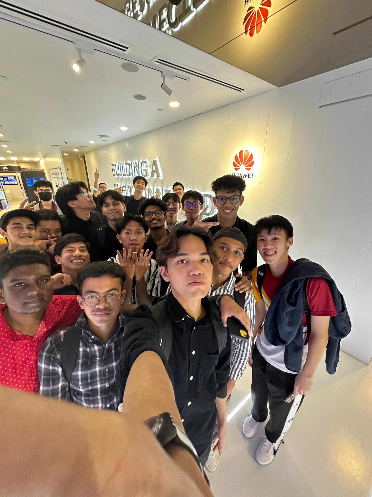
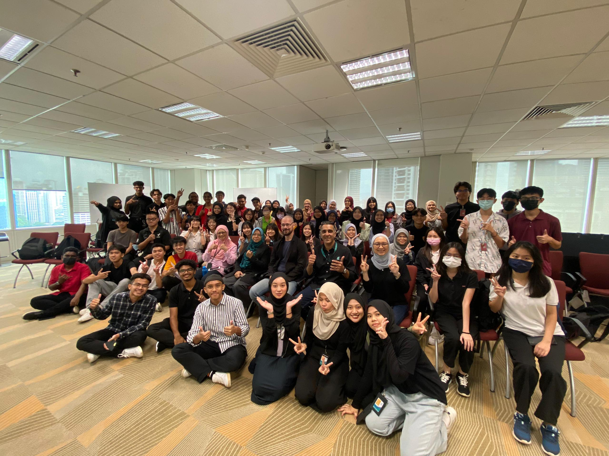
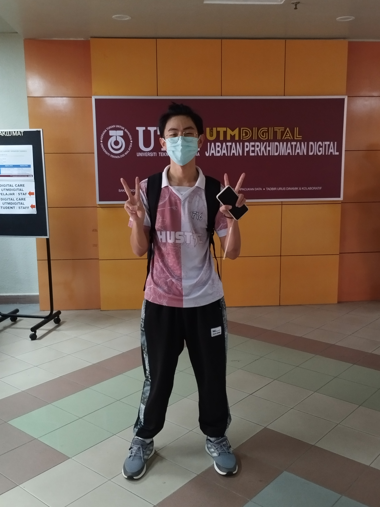
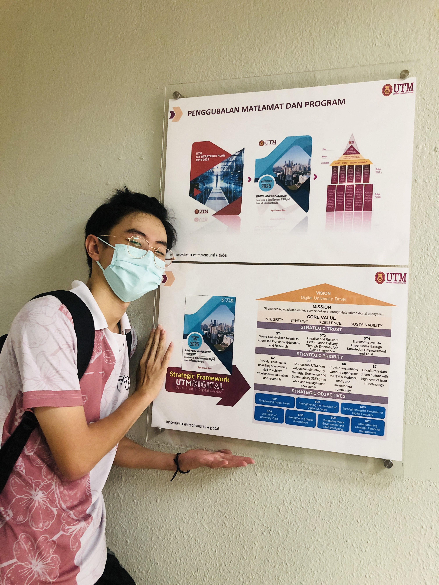

# Technology and Information System 
This course serves as an introductory introduction to information systems and technology (IS/IT) and how it can be used both at home and at work. There will be an introduction to several parts of IS/IT, including network, communications, hardware, and software. A significant part of the study will be focused in the labs where students will gain actual experience with PC installation and productivity applications. As part of work-based learning, this class regularly hosts seminars and visits from industry leaders. Students will be exposed to a real working environment, learn from the business, and see an increase in industry-university engagement through both industry visits and seminars. Additionally, the student does a quick investigation into the required skills and employment requirements for an IT career.

# Timeline

| Date | Activities   |
|--|--|
|23.10.2023 | Industry Talk on Career Development by Mr Habib|
|28.10.2023 | Industry Talk from PPG
|14.11.2023 | Virtual industrial talk on Overview of ICT Jobs in Clarity Techworks |
|17.11.2023 | Industry visit to Petronas and Huawei|
|5.12.2023 | Virtual industry talk by UTM Digital |
|13.12.2023 | Industry visit to UTM Digital|
|28.12.2023 | Virtual industry talk about System Development |

 

- [x] Assignment 1 (Career Development) 
[Poster linkedin](https://www.linkedin.com/posts/esys-sheng-34a008299_throughout-this-talk-we-learn-about-the-activity-7126741162597478400-LE9Q?utm_source=share&utm_medium=member_desktop)

> Throughout this talk, we learn about the journey of a data engineer, from obtaining a bachelor's degree, entering the industry for internships, and becoming a full-fledged data engineer analyst. In the future, he or she will evolve into a data engineering specialist.

---

[presentation slide](https://drive.google.com/file/d/1xTrJZGQe1PjWYymB2eztPliefIQKypp_/view?usp=drive_link)
-> https://drive.google.com/file/d/1xTrJZGQe1PjWYymB2eztPliefIQKypp_/view?usp=drive_link
- [x] Assignment 2 (Presentation Ch 7 & 8)

 

> The ubiquity of technology prompts consideration of its ramifications, particularly concerning personal privacy. The question arises as to whether technology facilitates unauthorized access to our private information. Instances such as applying for a loan, obtaining a driver's license, or conducting transactions at supermarkets raise concerns about the potential dissemination and utilization of our information without explicit consent. Similarly, the pervasive use of the internet prompts reflection on the collection and sharing of personal data. A critical inquiry emerges regarding the ways in which criminals might exploit this information for illicit purposes, such as **ransom, blackmail, or acts of vandalism.**

---

- [x] Assignment 3 (Design Thinking)

>In design thinking, inventors create or modify applications, employing critical thinking to meet users' needs. The core principles are empathy, ideate, prototyping, and iteration adapt to solve complex problems, >ensuring effective, user-friendly solutions. There are many types of computer software, such as educational software, utility software, application software, enterprise software, programming software and system >software. However, our report mainly delves into educational software, emphasizing the importance of tailored solutions within this broader domain.

- [Video for Design Thinking](https://www.youtube.com/watch?v=AEObz1Dx_Mo)
- [Report of Design Thinking](https://github.com/cxchew/TIS/blob/main/image/tis%20assignment%20rework%20(1)%20(1).docx)
- [Slide for presenting Design Thinking]

  ## Presentation Slide
 

---
**4) <ins>Assignment 4 (Newsletter)**
- Description:
  > On Friday, 17 November 2023, first-year data engineering students had went to Petronas office (Menara ExxonMobil) and Huawei Customer Solution Innovation Centre (CSIC) in Kuala Lumpur for an industry visits. Through the visits in Petronas, we had widened our understanding about the productive mind of a software engineer and his crucial role in a company. Besides that, mentioned by the Head of software engineering and testing at PETRONAS Digital, Sir Roman Kvaska, we also learned that some skills like analytical skills and life-long learning is necessary to be mastered flawlessly to secure job in this competitive environment which technology kept advancing. While in Huawei, we were able to witness a cutting-edged technologies that beyond our curriculum. This had deepend our understanding about ICT and it's impacts to our daily life. Even though the visit was short and rushed, but we still able to learn many things fro the visits. Overall, the whole visits was great and memorable. I hope we can visits more industries similar to these visits in the future.
  - [Newsletter](https://github.com/cxchew/TIS/blob/main/image/ASSIGNMENT%203%20INDUSTRY%20VISIT%20HUAWEIPETRONAS%20GROUP%202.pdf)
  - Photo:
    <table>
  <tr>
    <th>Petronas</th>
    <th>Huawei</th>
  </tr>
  <tr>
    <td></td>
    <td></td>
  </tr>
</table>

---

- [x] Assignment 5 ( UTMDigital visit)
- [Video](https://www.youtube.com/watch?v=46His0jLaX4)
- Photos: 
  </tr>
  <tr>
    <td></td>
    <td></td>
  </tr>
</table>

> On the 13th of December 2023, our class, TIS SECP1013 Section 02, had the privilege of visiting UTMDigital, courtesy of Dr Aryati. The office spaces at UTMDigital were designed in the style of Google Spaces, offering a flexible and collaborative environment capable of accommodating up to 60 staff members simultaneously. Plans were underway to expand the office further, adding more tables to facilitate an additional 20 to 25 staff. The open office layout featured workspaces, meeting rooms, discussion areas, and relaxation spaces, all contributing to a conducive and productive atmosphere for the staff.

> Our tour continued to the UTM Digital Care offices, where we gained insights into their pivotal role in addressing ICT issues through email correspondence. The problem-solving process involved multiple levels; initial resolutions occurred at the ground level through emails or simple calls. Persistent issues escalated to level 1, involving the technical team, and the final level, level 2, included direct engagement with providers like Telekom Malaysia.

> The concluding part of our visit took us to the highly secure Data Center. Photography was strictly prohibited due to the confidential nature of the operations within. Nevertheless, witnessing the intricacies of how UTM manages its data within a server room, monitored by the Network Operations Center (NOC), was fascinating. UTM's Data Center holds a tier-three classification, emphasizing its reliability and resilience.

> Reflecting on the overall experience, I left UTMDigital with a deep sense of satisfaction. This valuable exposure has heightened my enthusiasm to complete my bachelor's degree with excellence and aspire to work in an environment akin to UTMDigital. Gratitude goes to all the UTMDigital staff for their warm hospitality during the virtual talk and our visit.

 
      

---
- [x] Assignment 6 About PC ASSEMBLE

 
 

> During the **PC assembly session**, I gained insight into the internal components of a computer that I had never encountered before. Initially, participants were organized into groups of four or five members, with each group sharing a single CPU. The CPU was disassembled before we reassembled it collectively. Subsequently, we installed the motherboard into the CPU frame. Following the motherboard installation, we placed the processor and cooler fan in position. We ensured the processor was correctly aligned before securing it.

> Afterwards, we inserted the cooler fan into the processor and secured it. The power supply wire was also connected to the motherboard. Following that, the RAM board was inserted into the frame. Finally, we plugged in the VGA card, wire card, and all other cables before installing the cover case.

> This experience felt like a once-in-a-lifetime opportunity that I will never forget. I also learned about the functions of each component in the CPU and how they contribute to the overall system, thanks to **Dr. Aryati and the technicians**.
 

       

**7) <ins>Assignment 7 (Report)**
- Description:
  > On Thursday, 28th December 2023, Credence (TM Subsidiary) had organised an industrial talk for our UTM Students. The talk is about the system development of Credence and journey of having a career in analytic industry. Besides that, the talk also mentioned about their unique workplace culture in their company that can make them more comfortable in their workplace while working. Through the talk, we had widened our understanding about the technologies will be used in an industry and career we could have in our future for our course. Besides that, we also learned about some useful tips and motivation that can help us in our future. For example, we must eager to learn new things and explore more environment around us. The reason is to encourage us to walk out of our comfort zones and try to know more about our working partners and make friends with them while working in the industry.
  > In conclusion, even though the talk was very short, but it was resourceful as we able to learn more about the working environment in Credence and help us to know more about what we might be facing while having a career in an industry in the future. Thanks to our lecturer, Dr Aryati and the organiser of the talk, Miss Qistina for letting us to have a fun and memorable talk. We will always remember what we had learnt from the talk and apply it while in the industry after our graduation.

- Photo: 
  
   

