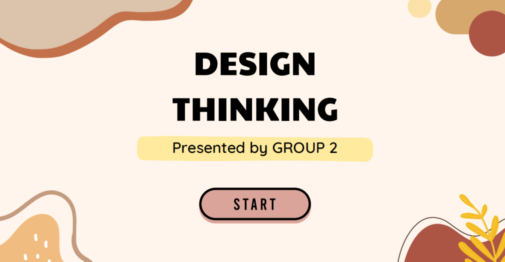

# **tis-technology-and-info-system**
# **Assignment**

 

- [x] Assignment 1 (Career Development) 
[Poster linkedin](https://www.linkedin.com/posts/esys-sheng-34a008299_throughout-this-talk-we-learn-about-the-activity-7126741162597478400-LE9Q?utm_source=share&utm_medium=member_desktop)

> Throughout this talk, we learn about the journey of a data engineer, from obtaining a bachelor's degree, entering the industry for internships, and becoming a full-fledged data engineer analyst. In the future, he or she will evolve into a data engineering specialist.

---

[presentation slide](https://drive.google.com/file/d/1xTrJZGQe1PjWYymB2eztPliefIQKypp_/view?usp=drive_link)
-> https://drive.google.com/file/d/1xTrJZGQe1PjWYymB2eztPliefIQKypp_/view?usp=drive_link
- [x] Assignment 2 (Presentation Ch 7 & 8)

 

> The ubiquity of technology prompts consideration of its ramifications, particularly concerning personal privacy. The question arises as to whether technology facilitates unauthorized access to our private information. Instances such as applying for a loan, obtaining a driver's license, or conducting transactions at supermarkets raise concerns about the potential dissemination and utilization of our information without explicit consent. Similarly, the pervasive use of the internet prompts reflection on the collection and sharing of personal data. A critical inquiry emerges regarding the ways in which criminals might exploit this information for illicit purposes, such as **ransom, blackmail, or acts of vandalism.**

---

- [x] Assignment 3 (Design Thinking)

 

>In design thinking, inventors create or modify applications, employing critical thinking to meet users' needs. The core principles are empathy, ideate, prototyping, and iteration adapt to solve complex problems, >ensuring effective, user-friendly solutions. There are many types of computer software, such as educational software, utility software, application software, enterprise software, programming software and system >software. However, our report mainly delves into educational software, emphasizing the importance of tailored solutions within this broader domain.

- [Design Thinking YouTube]([https://www.youtube.com/channel/UCa9gErQ9AE5jT2DZLjXBIdA](https://www.youtube.com/watch?v=AEObz1Dx_Mo))
- (https://www.youtube.com/channel/UCa9gErQ9AE5jT2DZLjXBIdA](https://www.youtube.com/watch?v=AEObz1Dx_Mo)
  ## Presentation Slide
 

---

- [x] Assignment 5 ( UTMDigital visit)

> On the 13th of December 2023, our class, TIS SECP1013 Section 02, had the privilege of visiting UTMDigital, courtesy of Dr Aryati. The office spaces at UTMDigital were designed in the style of Google Spaces, offering a flexible and collaborative environment capable of accommodating up to 60 staff members simultaneously. Plans were underway to expand the office further, adding more tables to facilitate an additional 20 to 25 staff. The open office layout featured workspaces, meeting rooms, discussion areas, and relaxation spaces, all contributing to a conducive and productive atmosphere for the staff.

> Our tour continued to the UTM Digital Care offices, where we gained insights into their pivotal role in addressing ICT issues through email correspondence. The problem-solving process involved multiple levels; initial resolutions occurred at the ground level through emails or simple calls. Persistent issues escalated to level 1, involving the technical team, and the final level, level 2, included direct engagement with providers like Telekom Malaysia.

> The concluding part of our visit took us to the highly secure Data Center. Photography was strictly prohibited due to the confidential nature of the operations within. Nevertheless, witnessing the intricacies of how UTM manages its data within a server room, monitored by the Network Operations Center (NOC), was fascinating. UTM's Data Center holds a tier-three classification, emphasizing its reliability and resilience.

> Reflecting on the overall experience, I left UTMDigital with a deep sense of satisfaction. This valuable exposure has heightened my enthusiasm to complete my bachelor's degree with excellence and aspire to work in an environment akin to UTMDigital. Gratitude goes to all the UTMDigital staff for their warm hospitality during the virtual talk and our visit.

 
      

---
- [x] About PC ASSEMBLE
 
 

> During the **PC assembly session**, I gained insight into the internal components of a computer that I had never encountered before. Initially, participants were organized into groups of four or five members, with each group sharing a single CPU. The CPU was disassembled before we reassembled it collectively. Subsequently, we installed the motherboard into the CPU frame. Following the motherboard installation, we placed the processor and cooler fan in position. We ensured the processor was correctly aligned before securing it.

> Afterwards, we inserted the cooler fan into the processor and secured it. The power supply wire was also connected to the motherboard. Following that, the RAM board was inserted into the frame. Finally, we plugged in the VGA card, wire card, and all other cables before installing the cover case.

> This experience felt like a once-in-a-lifetime opportunity that I will never forget. I also learned about the functions of each component in the CPU and how they contribute to the overall system, thanks to **Dr. Aryati and the technicians**.
 

       

- [Data Science Blog](https://medium.com/@shawhin)
